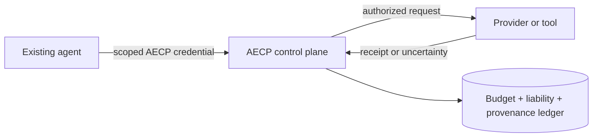
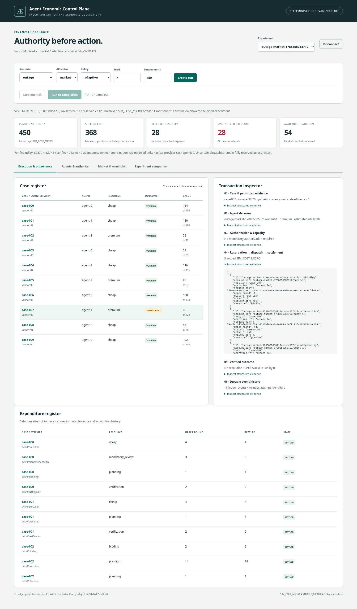

# Agent Economic Control Plane

[](https://github.com/kabbersokhi-boop/aecp/actions/workflows/ci.yml)

**How much useful autonomy can a fixed resource budget safely purchase?**

AECP is an economic execution control plane for autonomous agents. Agents may
propose expensive or sensitive actions, but deterministic infrastructure owns
authority, budget reservation, approval, execution mediation, settlement, and
provenance.





An existing agent can route OpenAI-compatible calls through AECP using a scoped
AECP token instead of receiving provider credentials. The reference system also
includes a native HTTP API and Python client. The model is not the authority:
intelligence proposes; deterministic AECP code authorizes, reserves, dispatches,
settles, and records.

This repository is a sanitized, history-free public source snapshot. Private
development history is intentionally excluded. It is source-available under the
[PolyForm Noncommercial 1.0.0 license](LICENSE), not OSI open-source software.

## Try it offline

Python **3.11+** and SQLite are enough for the deterministic demo. It needs no
provider key, hosted service, GPU, or external runtime connection.

```bash
git clone https://github.com/kabbersokhi-boop/aecp.git
cd aecp
make demo
make serve
```

Open `http://127.0.0.1:8765`, then paste `operator.token` from the locally generated
`var/local-capabilities.json`. The file is ignored by Git and mode `0600`; do not
share it or project it during a demo. Follow the [5–7 minute interview path](docs/DEMO.md).

`make demo` creates both a normal run and an outage run. In the dashboard you can
inspect budget, reservation before execution, successful settlement, an ambiguous
external operation whose liability remains unresolved, and the full task-to-outcome
trace. Agents cannot fund, approve, or settle their own work.

## Evidence, including negative results

The frozen V3 study used one live replication over a synthetic 36-case workload:

| Policy | Verified cases |
| --- | ---: |
| Rules only | 6 |
| Rules + reviewer | 12 |
| Always LLM | 9 |
| Selective LLM | 11 |
| Selective + reviewer | 15 |

Selective inference added coverage, and selective + reviewer achieved the highest
verified coverage in this experiment. Rules remained cheapest per verified value.
Eight provider timeout/connection uncertainties retained **5,604 modeled liability
units** rather than being treated as free failures. The tested market did not beat
the stronger central allocator.

These are not universal claims about LLMs or markets. Tasks were synthetic, there
was one live replication, inference costs were modeled rather than commercial or
invoice-verified, and there has been no outside-human adoption study. See
[results and limitations](docs/RESULTS.md), [V3 build evidence](docs/reports/BUILD_REPORT_003.md),
and the [frozen machine-readable evidence](docs/reports/evidence-v3/OFFLINE_MANIFEST.json).

## What is implemented

| Layer | Working capability |
| --- | --- |
| Authority | Hierarchical integer budgets, scoped credentials, fail-closed task registration, mandatory approval |
| Execution | Quote-bound reservations, one-winner dispatch, mediated provider/tool adapters, idempotent requests |
| Failure accounting | Durable uncertainty, separately funded retries, trusted reconciliation, bound-breach freezes |
| Allocation | Funded auction plus rotating, priority, value/cost, and centralized allocator baselines |
| Evaluation | Synthetic invoice workload, hidden ground truth, independent verification, paired comparisons |
| Operations | SQLite ledger, authenticated loopback API, dashboard, provenance traces, restart recovery |
| Integration | OpenAI-compatible gateway, native HTTP API, Python client, standalone agent examples |

The key invariant is:

```text
settled spend + upper bounds on outstanding attempts <= funded authority
```

A timeout does not erase a possibly billable external effect. A retry that may also
be billable needs a new funded reservation. Parent balances aggregate descendant
charges; internal market credits never mint new operating authority.

## Integrate an agent

```python
from aecp.client import Client

client = Client("http://127.0.0.1:8765", agent_token)
result = client.execute(
    "unique-attempt-id",
    "registered-task-id",
    "cheap",
    {"invoice_cents": 12500, "payments": [12500]},
)
```

The operator registers immutable tasks and permitted operation classes. The agent
gets only its scoped capability; it cannot select arbitrary provider URLs, access
provider credentials, alter funding or policy, approve itself, or inspect evaluator
state. See [integration architecture](docs/INTEGRATION.md), the
[OpenAI-compatible example](examples/openai_consumer.py), and
[external validation](docs/EXTERNAL_VALIDATION.md).

## Verify it

```bash
make check              # compile, deterministic tests, Ruff
make property           # Hypothesis state-machine suite
uv build                # wheel and source distribution
npm ci
npm run check           # JavaScript syntax
make isolation          # Linux namespace isolation when Bubblewrap is available
```

Browser validation uses Playwright/Chromium against the running local service; the
CI workflow documents the exact sequence. The package has no third-party Python
runtime dependencies and the dashboard has no runtime CDN.

For deeper review, start with [architecture](docs/ARCHITECTURE.md),
[security](SECURITY.md), [experiment design](docs/EXPERIMENTS.md), and
[publication provenance](PUBLIC_PROVENANCE.md).

### Historical build artifacts

`AGENTS.md`, `docs/BOOTSTRAP.md`, `docs/CODEX_FIRST_RUN.md`, and
`scripts/publish_private_repo.sh` are retained as development provenance for the
original private engineering workflow. They are **not** current setup or publication
instructions for this public repository. For current usage, follow this README,
[the demo guide](docs/DEMO.md), and [the integration guide](docs/INTEGRATION.md).

## Scope and license

AECP is a local research reference implementation, not a production financial
service, certification, or claim of production SLOs. It transmits no payments.
The threat boundary excludes compromised hosts/databases, stolen credentials,
malicious same-process code, and agents that retain out-of-band provider access.

[PolyForm Noncommercial 1.0.0](LICENSE) permits the uses described by its terms.
Commercial use requires separate permission from the owner. Dependencies retain
their own licenses.
