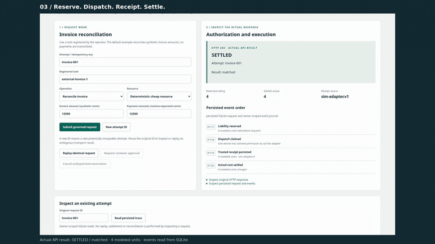
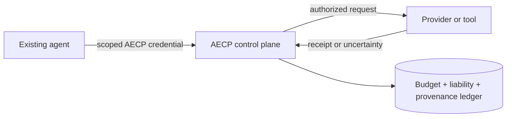

# Agent Economic Control Plane

[](https://github.com/kabbersokhi-boop/aecp/actions/workflows/ci.yml)

**Useful autonomy. Bounded liability.**

AECP is an economic execution control plane for autonomous agents. Agents may
propose expensive or sensitive actions, but deterministic infrastructure owns
authority, budget reservation, approval, execution mediation, settlement, and
provenance.

## The business problem

An AI worker checking invoices may need to call models or tools. Giving it access
does not answer three important questions: **may it do this work, can it afford
another attempt, and what happens if the provider executes but its response is lost?**

Parallel work and retries can overcommit shared funding. A timeout can hide a
real charge. Sensitive actions still need separate approval. AECP puts a budget
controller, permissions gatekeeper and durable audit trail between the agent's
proposal and execution. The agent is never its own funding or approval authority.

## Watch the end-to-end demo

[](https://github.com/kabbersokhi-boop/aecp/raw/393dd3ee463b5cfe84f83b71253f7d4d4f1b8527/docs/assets/portfolio/AECP-Portfolio-Demo.mp4)

**[Watch / download the full demo — 3:09, 1080p MP4](https://github.com/kabbersokhi-boop/aecp/raw/393dd3ee463b5cfe84f83b71253f7d4d4f1b8527/docs/assets/portfolio/AECP-Portfolio-Demo.mp4)** · One edited recording, silent and ready for voiceover. The looping preview is a short sample, not the full video.

- **0:08 — Give the agent a bounded mandate.** Inspect its 8-unit cap and enter a synthetic invoice through an agent-scoped HTTP client.
- **0:26 — Complete useful work.** Follow reservation → dispatch → trusted receipt → settlement. Replay the same attempt without another dispatch or charge.
- **0:49 — Challenge its authority.** A protected action requires separate approval; another request is denied once the disposable budget is exhausted.
- **1:12 — Inspect the operator's view.** Review the separate 36-case reference run and delegated scopes: child caps share parent funding, rather than creating money.
- **1:30 — Challenge the happy path.** Switch explicitly to independent fault fixtures: a lost response retains liability, another retry needs funding, and worker death does not erase exposure.
- **2:23 — Recover from evidence, not optimism.** A durable receipt settles without redispatch; trusted charged/no-charge evidence permits reconciliation. A quote breach records the full charge and freezes the affected scope.

**Recording scope:** real local HTTP requests and SQLite state, followed by a freshly generated offline report of **12 separate controlled fault scenarios / 17 simulated provider executions / 0 hosted calls**. Costs are modeled units, not cash. No real payments, human reviewer approval or fresh NVIDIA inference are claimed; credentials and personal screens are excluded.

[Screenshot walkthrough and reproduction steps](docs/PORTFOLIO_DEMO.md) · [Integration contract](docs/INTEGRATION.md) · [Build and failure evidence](docs/reports/BUILD_REPORT_004.md)

## How the boundary works


```mermaid
flowchart LR
    A[Existing agent] -->|scoped AECP credential| C[AECP control plane]
    C -->|authorized request| R[Provider or tool]
    R -->|receipt or uncertainty| C
    C --> L[(Budget + liability + provenance ledger)]
```

An existing agent can route OpenAI-compatible calls through AECP using a scoped
AECP token instead of receiving provider credentials. The reference system also
includes a native HTTP API and Python client. The model is not the authority:
intelligence proposes; deterministic AECP code authorizes, reserves, dispatches,
settles, and records.

This repository is a sanitized, history-free public source snapshot. Private
development history is intentionally excluded. It is source-available under the
[PolyForm Noncommercial 1.0.0 license](LICENSE), not OSI open-source software.

## Try it offline

Python **3.11+** and SQLite are enough for the deterministic demo. It needs no
provider key, hosted service, GPU, or external runtime connection.

```bash
git clone https://github.com/kabbersokhi-boop/aecp.git
cd aecp
make demo
make serve
```

Open `http://127.0.0.1:8765`, then paste `operator.token` from the locally generated
`var/local-capabilities.json`. The file is ignored by Git and mode `0600`; do not
share it or project it during a demo. Follow the [5–7 minute interview path](docs/DEMO.md).

`make demo` creates both a normal run and an outage run. In the dashboard you can
inspect budget, reservation before execution, successful settlement, an ambiguous
external operation whose liability remains unresolved, and the full task-to-outcome
trace. Agents cannot fund, approve, or settle their own work.

## Two moments worth inspecting

Open `/agent.html` to enter a registered invoice task using an agent-scoped
capability. Follow the actual API response and persisted execution timeline;
replay the same attempt without another dispatch, or inspect an approval denial.
The recorded invoice settles for 4 modeled units, with each execution phase
visible in the owner-scoped event journal.


Run `make failure-conformance`, then load `var/failure-conformance.json` in the
dashboard's **Failure evidence** view. Compare the independent fake-provider
journal with AECP's retained liability, retry admission, restart recovery, trusted
reconciliation and honest bound-breach reporting. These are separate controlled
scenarios, not invented stages of one live request.
In the frame below, the provider fixture records execution and a 3-unit charge,
but no delivered response. AECP correctly keeps the 4-unit ceiling reserved as
`UNRESOLVED` instead of treating the missing response as a refund.


See the [six-step portfolio story and recording boundaries](docs/PORTFOLIO_DEMO.md).

## Evidence, including negative results

The frozen V3 study used one live replication over a synthetic 36-case workload:

| Policy | Verified cases |
| --- | ---: |
| Rules only | 6 |
| Rules + reviewer | 12 |
| Always LLM | 9 |
| Selective LLM | 11 |
| Selective + reviewer | 15 |

Selective inference added coverage, and selective + reviewer achieved the highest
verified coverage in this experiment. Rules remained cheapest per verified value.
Eight provider timeout/connection uncertainties retained **5,604 modeled liability
units** rather than being treated as free failures. The tested market did not beat
the stronger central allocator.

These are not universal claims about LLMs or markets. Tasks were synthetic, there
was one live replication, inference costs were modeled rather than commercial or
invoice-verified, and there has been no outside-human adoption study. See
[results and limitations](docs/RESULTS.md), [V3 build evidence](docs/reports/BUILD_REPORT_003.md),
and the [frozen machine-readable evidence](docs/reports/evidence-v3/OFFLINE_MANIFEST.json).

## What is implemented

| Layer | Working capability |
| --- | --- |
| Authority | Hierarchical integer budgets, scoped credentials, fail-closed task registration, mandatory approval |
| Execution | Quote-bound reservations, one-winner dispatch, mediated provider/tool adapters, idempotent requests |
| Failure accounting | Durable uncertainty, separately funded retries, trusted reconciliation, bound-breach freezes |
| Allocation | Funded auction plus rotating, priority, value/cost, and centralized allocator baselines |
| Evaluation | Synthetic invoice workload, hidden ground truth, independent verification, paired comparisons |
| Operations | SQLite ledger, authenticated loopback API, dashboard, provenance traces, restart recovery |
| Integration | OpenAI-compatible gateway, native HTTP API, Python client, standalone agent examples |

With valid declared liability bounds and trusted execution mediation, the key
invariant is:

```text
settled spend + upper bounds on outstanding attempts <= funded authority
```

A timeout does not erase a possibly billable external effect. A retry that may also
be billable needs a new funded reservation. Parent balances aggregate descendant
charges; internal market credits never mint new operating authority.
If a provider exceeds its declared bound, AECP records the full charge and freezes
affected authority. It does not clip the cost or pretend the guarantee survived.

## Integrate an agent

```python
from aecp.client import Client

client = Client("http://127.0.0.1:8765", agent_token)
result = client.execute(
    "unique-attempt-id",
    "registered-task-id",
    "cheap",
    {"invoice_cents": 12500, "payments": [12500]},
)
```

The operator registers immutable tasks and permitted operation classes. The agent
gets only its scoped capability; it cannot select arbitrary provider URLs, access
provider credentials, alter funding or policy, approve itself, or inspect evaluator
state. See [integration architecture](docs/INTEGRATION.md), the
[OpenAI-compatible example](examples/openai_consumer.py), and
[external validation](docs/EXTERNAL_VALIDATION.md).

## Verify it

```bash
make check              # compile, deterministic tests, Ruff
make property           # Hypothesis state-machine suite
uv build                # wheel and source distribution
npm ci
npm run check           # JavaScript syntax and presentation tests
make isolation          # Linux namespace isolation when Bubblewrap is available
```

Browser validation uses Playwright/Chromium against the running local service; the
CI workflow documents the exact sequence. The package has no third-party Python
runtime dependencies and the dashboard has no runtime CDN.

For deeper review, start with [architecture](docs/ARCHITECTURE.md),
[security](SECURITY.md), [experiment design](docs/EXPERIMENTS.md), and
[publication provenance](PUBLIC_PROVENANCE.md). Reliability work is documented in
the [failure-conformance contract](docs/FAILURE_CONFORMANCE.md); the stronger
[outcome-study protocol](docs/OUTCOME_STUDY_PROTOCOL.md) remains explicitly unrun.

### Historical build artifacts

`AGENTS.md`, `docs/BOOTSTRAP.md`, `docs/CODEX_FIRST_RUN.md`, and
`scripts/publish_private_repo.sh` are retained as development provenance for the
original private engineering workflow. They are **not** current setup or publication
instructions for this public repository. For current usage, follow this README,
[the demo guide](docs/DEMO.md), and [the integration guide](docs/INTEGRATION.md).

## Scope and license

AECP is a local research reference implementation, not a production financial
service, certification, or claim of production SLOs. It transmits no payments.
The threat boundary excludes compromised hosts/databases, stolen credentials,
malicious same-process code, and agents that retain out-of-band provider access.

[PolyForm Noncommercial 1.0.0](LICENSE) permits the uses described by its terms.
Commercial use requires separate permission from the owner. Dependencies retain
their own licenses.
