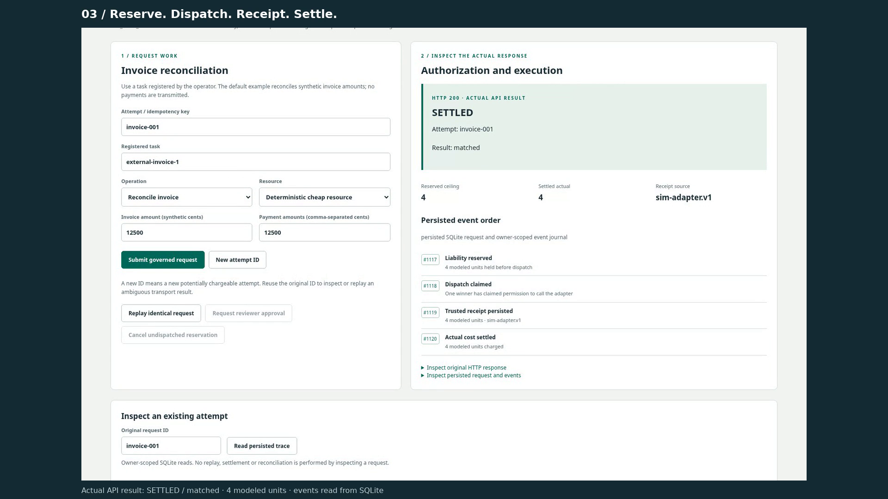
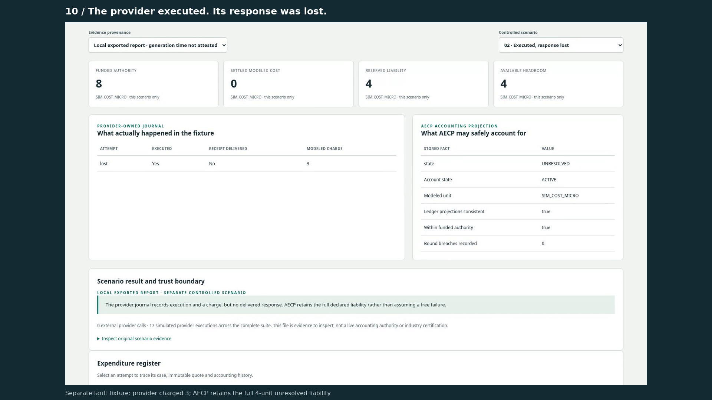

# Portfolio demo: useful autonomy, bounded liability

[Watch / download the recorded demo — 3:09, silent 1080p MP4](https://github.com/kabbersokhi-boop/aecp/raw/393dd3ee463b5cfe84f83b71253f7d4d4f1b8527/docs/assets/portfolio/AECP-Portfolio-Demo.mp4)

The [README's timed pointers](../README.md#watch-the-end-to-end-demo) summarize
the recording. This guide explains its evidence and how to reproduce the path.

## The business problem

An invoice agent can be useful and still make unsafe spending decisions. Parallel
workers share funding. A retry may be another charge. A timeout does not prove
that the provider did nothing. Sensitive actions still need separate approval.

AECP puts a deterministic execution boundary between an agent's proposal and the
provider or tool. The demonstration starts with useful work, then challenges the
assumptions that normally make a happy-path demo look safer than it is.

## Prepare without provider access

```bash
make demo
make failure-conformance
make serve
```

Keep `var/local-capabilities.json` off-screen. Connect to `/agent.html` with the
locally generated `passive.token`; it owns `gateway/passive` and has registered
`external-invoice-1` and `protected-payment` tasks. The console uses the same public
API as an independent consumer, not an operator shortcut. Agent capabilities stay
in page memory and are cleared on disconnect.

The portfolio recording uses a separately provisioned 8-unit child cap for a
compact overspend demonstration. The default passive cap is 1,000 units; do not
expect three 4-unit requests to exhaust it. An operator can provision a disposable
identity through `/api/v1/admin/agents` and register the two tasks through
`/api/v1/admin/tasks`, as exercised in `scripts/portfolio_browser.cjs`.

## The story in six steps

1. **Give an agent a bounded mandate.** Show its funded cap, settled cost,
   outstanding liability and effective headroom. These are modeled units, not cash.
2. **Request useful work.** Enter a synthetic 12,500-cent invoice and matching
   payment. Submit a registered reconciliation task using the cheap deterministic
   resource. Follow the persisted reserve → dispatch → receipt → settle timeline.
3. **Challenge authority.** Replay the identical attempt: the durable result and
   event sequence do not change. A protected payment operation returns
   `APPROVAL_REQUIRED`; requesting approval returns `PENDING`, not self-approval.
   Exhaust the disposable cap and show admission denial before dispatch.
4. **Show the operator's view.** In the `ordinary` reference run, inspect 36
   verified cases, 450 funded units and 384 settled units. Child balances are
   constraints on the same parent funding, not additional funded money.
5. **Make failure visible.** Open **Failure evidence**, load the newly generated
   `var/failure-conformance.json`, and inspect the independent provider journal
   next to AECP accounting. Response loss retains liability; a potentially
   chargeable retry needs its own reservation; worker death cannot erase exposure.
6. **End with an honest boundary.** A durable receipt can settle without
   redispatch. Trusted charged/no-charge evidence can reconcile. The recorded
   quote-breach fixture settles an actual 7-unit charge and freezes the scope;
   it still has positive headroom of 5. A quote breach and a funding breach are
   different facts—do not relabel this fixture as overspending.

## Two frames from the published recording

**Useful work completes under authority.** This is the real local invoice request,
its deterministic result and the persisted reserve → dispatch → receipt → settle
sequence. It does not transmit a payment.



**Failure does not become free.** This is a separate controlled response-loss
fixture. The exported provider journal records execution and a charge of 3; AECP
retains an unresolved liability of 4 because no definitive receipt was delivered.



## What the video does—and does not—prove

The agent segment executes real local HTTP requests against SQLite. The fault
segment inspects a freshly generated offline report: 12 separate controlled
scenarios and 17 simulated provider executions, with zero external provider calls.
Real subprocess deaths are exercised by that harness, not simulated by closing a
browser tab. The report viewer itself does not execute or reconcile requests.

This is a local reference implementation, not commercial invoice validation,
production adoption, a hostile-code sandbox, or exactly-once external billing.
The original frozen live NVIDIA studies remain historical. Existing hosted NIM
support can add a separately labelled, bounded live-model chapter after confirming
account allowance and authorizing calls; a valid model response still cannot grant
itself funding, approval or settlement.

At the owner's explicit request, the edited MP4 is published in
`docs/assets/portfolio/AECP-Portfolio-Demo.mp4`, with a small nine-second animated
preview. Raw recordings, capabilities and local databases remain outside Git.
The download link is pinned to the media commit so it remains valid after branch
cleanup. Authentication, terminals, account pages, the operating-system desktop
and personal tabs are excluded from the selected footage. Chapter headings and
short captions leave room for the owner's voiceover.

Published video SHA-256:

```text
024ac20400b1d3254a515accc496c2b49a8790fa96ff62f3a30da3f2e247c899
```

## Recheck the presentation

After starting a disposable local server and generating the fault report:

```bash
AECP_URL=http://127.0.0.1:8765 \
AECP_TOKENS=var/local-capabilities.json \
AECP_FAILURE_REPORT=var/failure-conformance.json \
node scripts/portfolio_browser.cjs
```

This test creates a small synthetic agent and submits governed requests. Do not
point it at an operational instance. It checks replay, approval, budget denial,
invalid report rejection, mobile layout and retention of a definitive response
when a subsequent budget refresh fails. `npm run check` includes exact-integer
and HTML-escaping tests for the presentation helpers.
